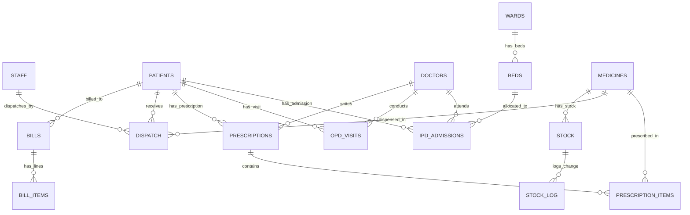

# MediCare Pro — E-Pharmacy & Hospital DBMS

MediCare Pro is a premium E-Pharmacy & Hospital Management Database System designed to streamline clinical records, inpatient/outpatient management, inventory tracking, pharmacy dispatches, and point-of-sale billing invoices.

Built on **MySQL 9.9**, **Node.js/Express**, and **React (Vite) + Tailwind CSS v3**, it integrates advanced database features such as triggers, stored procedures, cursor loops, and InnoDB row-level locking transactions.

---

## 🚀 Key Features

*   **👨‍⚕️ Inpatient (IPD) & Outpatient (OPD) Workflows**:
    *   Sequential 6-digit Patient IDs auto-assigned on registration.
    *   Patient Lookup page to view historical records, active bed numbers, and prescriptions.
*   **👥 Role-Based Dashboard Personalization**:
    *   Conditionally renders different dashboards for **Admin**, **Doctor**, **Pharmacist**, and **Nurse** roles by decoding user role attributes from JWT tokens.
    *   Gated sidebar navigation hides/shows tabs based on role authorization allowlists.
*   **🛌 Interactive Bed Management**:
    *   Color-coded bed layout grids (Available, Occupied, Maintenance) mapped across ICU and General Wards.
    *   Trigger-driven bed status transitions (Automatically changes to `'Occupied'` upon admission and `'Available'` upon discharge/billing).
*   **💊 FEFO (First Expired, First Out) Medicine Dispatch**:
    *   Runs via an **InnoDB Stored Transaction** (`sp_dispatch_medicine`) using a **cursor loop** to walk through medicine batches ordered by `expiry_date ASC`.
    *   Ensures earliest-expiring stock batches are consumed first, spilling over into subsequent batches when filling large quantities.
    *   Utilizes InnoDB `FOR UPDATE` row-level locks for concurrent safety.
*   **📊 Inventory & Low Stock Alerts**:
    *   List view of stocks with reorder indicators mapped across different batches.
    *   Cursor-driven procedure (`sp_low_stock_report`) generating real-time replenishment alerts.
    *   Audit trail logs capturing intake and dispatch events referencing specific batches.
*   **🧾 Point-of-Sale Billing & jsPDF Invoice Generator**:
    *   Compiles dispatches made today with consultation fees.
    *   Supports dynamic discount policies (e.g. Senior Citizen, Hospital Staff, Insurance).
    *   Generates a print-ready PDF invoice with hospital branding, customer contact details, itemized totals, and a verified "Paid" stamp.
*   **💬 WhatsApp Discharge Summary Sharing**:
    *   Point-of-Sale Billing page provides a "Send via WhatsApp" button that automatically parses invoice, doctor, and patient metadata.
    *   Launches a pre-filled, beautifully formatted structured text summary using WhatsApp's official deep-link API.
*   **📈 Sales Analytics**:
    *   Month/Year calendar analytics selector.
    *   Visual charts (Recharts Bar & Pie charts) highlighting top-selling medicines and category-wise revenue shares.


---

## 🛠 Tech Stack

*   **Core**: HTML5, Vanilla JavaScript, ES6 modules
*   **Styling**: Tailwind CSS v3 (Customized Teal & Mint palette, Inter font family)
*   **Frontend**: React (Vite SPA) + Recharts (Analytics) + Lucide Icons + jsPDF
*   **Backend**: Node.js + Express + CORS + Morgan + JWT Auth
*   **Database**: MySQL 9.9 (Raw queries via `mysql2/promise` connection pool)

---

## 📊 Relational Database Design

The relational database is normalized up to **3NF** to prevent duplication and delete anomalies:



---

## 📂 Project Structure

```text
E-PHARMACY/
│
├── database/               # Database SQL files
│   ├── schema.sql          # Core tables layout (15 tables)
│   ├── triggers.sql        # Bed release and stock auditing triggers
│   ├── procedures.sql      # Stored procedures & transaction blocks
│   └── seed.sql            # Dummy patients, stock, and staff
│
├── backend/                # Node.js/Express application
│   ├── config/             # DB Pool configuration
│   ├── middleware/         # JWT Auth guards
│   ├── routes/             # Express routes for each subsystem
│   └── server.js           # Server bootstrap setup
│
├── frontend/               # React SPA client
│   ├── src/
│   │   ├── components/     # Visual elements (Sidebar, Navbar)
│   │   ├── pages/          # Layout sections (Login, Dashboard, Billing)
│   │   ├── utils/          # API Axios instances, PDF generators
│   │   ├── App.jsx         # App router state wrapper
│   │   └── index.css       # Tailwind config import
│   ├── tailwind.config.js  # Tailwind theme properties
│   └── index.html          # HTML head title and SEO meta tag
```

---

## ⚡ Quick Start Guide

### 1. Database Setup
Ensure your local MySQL server is active, then execute:

```bash
# Connect and initialize the database structure
mysql -u root -p -e "CREATE DATABASE IF NOT EXISTS medicare_pro;"
mysql -u root -p medicare_pro < database/schema.sql
mysql -u root -p medicare_pro < database/triggers.sql
mysql -u root -p medicare_pro < database/procedures.sql
mysql -u root -p medicare_pro < database/seed.sql
```

### 2. Backend Installation & Start
Create a `backend/.env` file with your credentials:
```env
PORT=5000
DB_HOST=localhost
DB_USER=root
DB_PASS=adarsh2005
DB_NAME=medicare_pro
JWT_SECRET=supersecretjwttokenmedicarepro2026
```

Install packages and run the server:
```bash
cd backend
npm install
npm start
```

### 3. Frontend Installation & Start
```bash
cd ../frontend
npm install
npm run dev
```

Open [http://localhost:5173/](http://localhost:5173/) on your browser.

---

## 🔑 Demo Access Credentials

The login system supports logging in using **either** the personalized `username` (e.g. `sneha`) or the user's `Full Name` (e.g. `Sneha Patel`).

| Staff Name | User Role | Username / Login Key | Password |
| :--- | :--- | :--- | :--- |
| **System Administrator** | Admin | `admin` or `System Administrator` | `password123` |
| **Rahul Sharma** | Pharmacist | `rahul` or `Rahul Sharma` | `password123` |
| **Sneha Patel** | Nurse | `sneha` or `Sneha Patel` | `password123` |
| **Dr. Amit Patel** | Doctor | `amit` or `Dr. Amit Patel` | `password123` |


---

## 🧪 E2E Demo Verification Flow

1.  **Staff Authentication**: Sign in using `admin` / `password123`.
2.  **Registration Wizard**: Head to **Register Patient**, enter details, select **IPD**, choose an available bed and a doctor, and submit. Note the 6-digit ID (e.g. `100004`).
3.  **Prescription Logging**: Go to **Patient Lookup**, search the ID, click **Write Prescription**, add medicine lines, and submit.
4.  **Medicine Dispatch**: Head to **Medicine Dispatch**, search the patient, and click **Execute Dispatch**. Verify that inventory decreases and stock logs are appended under **Stock & Inventory**.
5.  **Bill Discharge**: Go to **Billing & Invoice**, pull up the patient, click **Generate & Print PDF Bill**. This frees the bed and downloads the receipt.
